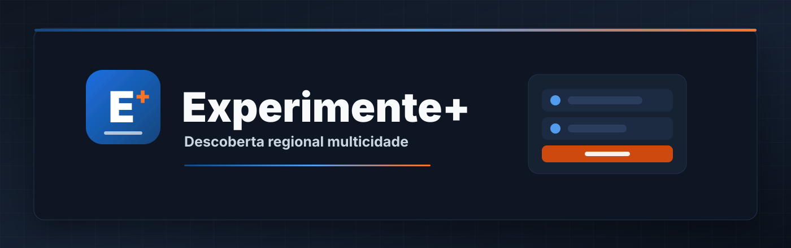
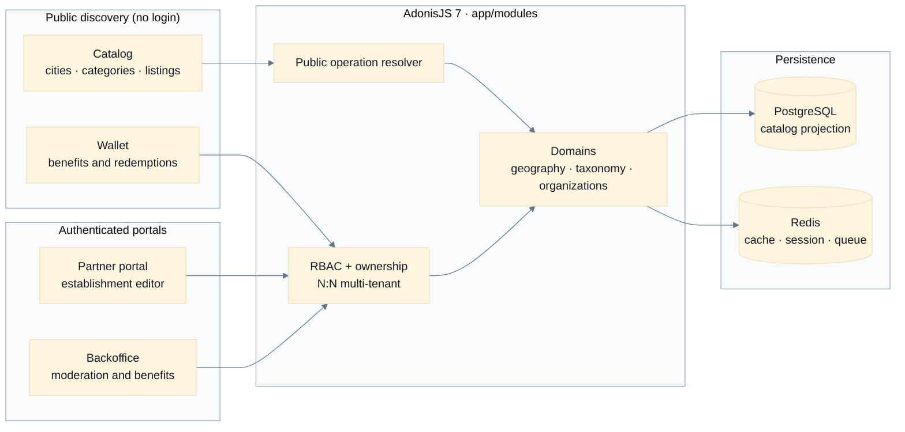
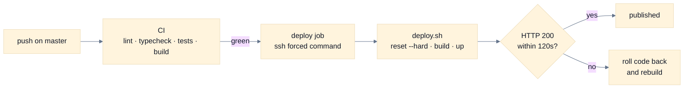

<div align="center">



**Closer than you think. More interesting than you expected.**

<p>
  <a href="https://adonisjs.com/"></a>
  <a href="https://react.dev/"></a>
  <a href="https://www.postgresql.org/"></a>
  <a href="https://redis.io/"></a>
  <a href="https://tailwindcss.com/"></a>
  <a href="./docs/product/README.md"></a>
  <a href="./LICENSE"></a>
</p>

<p>
  <a href="README.md">Português</a>
  ·
  <a href="README.en.md">English</a>
</p>

---

_"City and category are discovery dimensions. A tenant is an isolated platform operation."_

</div>

---

> [!IMPORTANT]
> **Discovery first, no sign-up required.** Experimente+ is a multi-city, multi-category regional
> guide: it surfaces restaurants, cafés, culture, wellness, and local services with listings
> reviewed before publication. The public catalog is resolved per operation, not per membership —
> nobody needs an account to explore.

> [!NOTE]
> **Built for a real region.** The initial launch is northern Paraná, around Cornélio Procópio,
> Londrina, and nearby municipalities. Restaurants, bars, and cafés are the core, but the product
> stays extensible to cinemas, tattoo studios, leisure, culture, and other local services.
> Tour Londrina is a product-experience reference, not a functional contract to copy.

---

## Quick start

```bash
# Dependencies
mise use node@24
pnpm install --frozen-lockfile

# Local environment
cp .env.example .env
pnpm ace generate:key

# Infrastructure
docker compose up -d postgres redis mailpit

# Database and development data
pnpm ace migration:run
pnpm ace db:seed

# Adonis + Inertia dev server with HMR
pnpm dev
```

The app serves on `http://localhost:3333`. Prerequisites: Node.js 24 (per `.nvmrc`), pnpm 11, and
Docker Compose.

---

## What it does

| Layer              | Purpose                                                                    | Where it lives                           |
| :----------------- | :------------------------------------------------------------------------- | :--------------------------------------- |
| **Geography**      | Regions, cities, and the public geography catalog.                         | `app/modules/geography/`                 |
| **Taxonomy**       | Hierarchical categories with typed attributes and effective inheritance.   | `app/modules/taxonomy/`                  |
| **Organizations**  | Memberships, invitations, and transactional claims over establishments.    | `app/modules/organizations/`             |
| **Establishments** | Stable identity with revisioned public content and versioned completeness. | `app/modules/establishments/`            |
| **Moderation**     | Submission, publication gates, and revision history.                       | `app/modules/establishments/` · `media/` |
| **Catalog**        | Public discovery by city and category, served from a projection.           | `app/modules/catalog/`                   |
| **Benefits**       | Editions, offers, accesses, and redemptions in the consumer wallet.        | `app/modules/benefits/`                  |
| **Analytics**      | Impressions, contact clicks, and searches without results, with retention. | `app/modules/analytics/`                 |

---

## Architecture



The public catalog resolves the operation from the hostname or `PUBLIC_TENANT_SLUG`, without
requiring membership. Authenticated areas go through RBAC, contextual permissions, and ownership.

---

## Structure

```text
app/modules/<domain>/   full backend domain
app/shared/             cross-cutting infrastructure
database/               migrations, factories, and seeders
inertia/                pages, layouts, components, and hooks
resources/              translations, Edge templates, and emails
tests/                  unit, functional, and browser tests
docs/product/           vision, MVP, roadmap, and product decisions
docs/architecture/      ADRs and accepted technical contracts
docs/                   OpenAPI, Redoc, and HTTP requests
```

Each domain keeps its controllers, services, repositories, models, validators, and routes together.
Adonis generators emit files into the default layout; move the result into `app/modules/<domain>/`
and rewrite the imports to `#modules/*` and `#shared/*`.

---

## Local environment

| Service      | Address                      |
| ------------ | ---------------------------- |
| Application  | `http://localhost:3333`      |
| PostgreSQL   | `localhost:5435`             |
| Redis        | `localhost:6381`             |
| Mailpit SMTP | `localhost:1026`             |
| Mailpit UI   | `http://localhost:8026`      |
| Redoc        | `http://localhost:3333/docs` |

Ports are configurable through `.env`.

### Development accounts

The seeder creates three deterministic accounts that cover the full pilot journey:

```text
Admin:    admin@experimente.local
Partner:  partner@experimente.local
Customer: cliente@experimente.local
Password: experimente123
```

> [!WARNING]
> These credentials exist for the local environment only and must never reach a host that is
> reachable from the internet. They are configurable through `DEV_ADMIN_*`, `DEV_PARTNER_*`, and
> `DEV_CUSTOMER_*`. The regional data, establishments, offers, and accesses the seeder creates are
> fictional.

The seeder is `static environment = ['development']`: it is skipped under `NODE_ENV=production`.

---

## Commands

```bash
pnpm dev                 # server and Vite with HMR
pnpm build               # client, SSR, and backend build
pnpm lint                # ESLint
pnpm typecheck           # TypeScript backend + frontend
pnpm test:e2e            # Japa: unit, functional, and browser
pnpm test:ui             # Vitest
pnpm ace migration:run   # apply migrations
pnpm ace migration:fresh # rebuild the schema
pnpm ace db:seed         # deterministic development data
```

> [!NOTE]
> This project runs AdonisJS 7 with TypeScript executed directly through `@poppinss/ts-exec`.
> There is no `node ace` anymore: use `pnpm ace <command>`.

---

## Configuration

| Variable                                             | Purpose                                       |
| ---------------------------------------------------- | --------------------------------------------- |
| `APP_NAME`, `VITE_APP_NAME`, `APP_URL`               | application identity and URLs                 |
| `APP_LOCALE`                                         | default locale (`pt` or `en`)                 |
| `PUBLIC_TENANT_SLUG`                                 | public operation when the host cannot resolve |
| `BENEFIT_PRESENTATION_BASE_URL`                      | canonical origin for QR validation links      |
| `ACCESS_TOKEN_SECRET`, `REFRESH_TOKEN_SECRET`        | independent API secrets                       |
| `EMAIL_VERIFICATION_SECRET`, `PASSWORD_RESET_SECRET` | HMAC for single-use links                     |
| `JWT_ISSUER`, `JWT_AUDIENCE`, `JWT_COOKIE_NAME`      | token identity and web cookie                 |
| `REGISTRATION_WORKSPACE_MODE`                        | onboarding `none`, `personal`, or `operation` |
| `DEMO_PAGES_ENABLED`                                 | internal visual reference pages               |
| `DRIVE_DISK`                                         | `fs`, `s3`, `spaces`, `r2`, or `gcs`          |

Optional secrets fall back to `APP_KEY` during development only. Production must use long,
independent values stored outside the repository.

The origin embedded in a QR code follows a closed precedence chain:
`BENEFIT_PRESENTATION_BASE_URL`; then, only in production, `APP_URL`; and the trusted request
protocol/host only during development or tests. In production, the selected origin must use
`https://`; `http://` is limited to development and tests. The variables must contain only an
absolute origin, without credentials, path, query, or fragment. Production startup fails when no
valid canonical HTTPS origin is available, preventing `Host` or `X-Forwarded-Host` from controlling
the validation link. The local `docker-compose.yml` defaults to `NODE_ENV=development`, while
`docker-compose.vps.yml` pins `NODE_ENV=production`.

> [!IMPORTANT]
> The public resolver reads the **first hostname label**. On `experimente-plus.example.com` it looks
> for an operation with slug `experimente-plus` and ignores `PUBLIC_TENANT_SLUG`. The tenant slug
> has to follow the subdomain the operation is served from.

---

## Deploy

The pipeline in [`.github/workflows/ci-cd.yml`](.github/workflows/ci-cd.yml) runs on every push:
frozen install, lint, typecheck, Japa suites, Vitest, and the production build. On `master`, a
`deploy` job connects over SSH and triggers [`deploy.sh`](deploy.sh) on the host.



`deploy.sh` syncs with `origin/master`, rebuilds the image, starts the container — which applies
pending migrations before serving — and waits for the app to answer. If it never answers, the code
returns to the previous commit.

> [!WARNING]
> The rollback covers **code only**. Migrations already applied are not reverted.

[`docker-compose.vps.yml`](docker-compose.vps.yml) describes the host: the application service
alone, published on the loopback only, behind an nginx that terminates TLS. PostgreSQL and Redis are
shared containers reached over an external Docker network.

The key the CI uses carries a forced command in the host's `authorized_keys`, so it runs `deploy.sh`
and nothing else.

---

## Migrations before version 1.0

While the product has no published stable version, the schema must describe a fresh, canonical
install. Changes to unreleased tables belong in the original `create_*` migration; disposable
development and test databases should be recreated.

After the first stable release, history becomes append-only.

---

## Product planning

The canonical plan lives under [`docs/product/`](docs/product/README.md) and the accepted technical
contracts under [`docs/architecture/decisions/`](docs/architecture/decisions/README.md): business
vision and model, actors and journeys, MVP, metrics and roadmap, the city/organization/establishment
model, domain boundaries, accepted decisions, open questions, and market references.

No product-domain migration should be introduced before its decision is recorded in the plan and,
when structural, in an accepted ADR.

---

## License

MIT. See [LICENSE](LICENSE).
