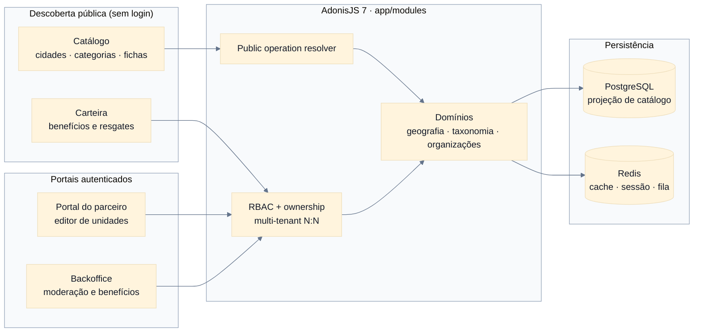
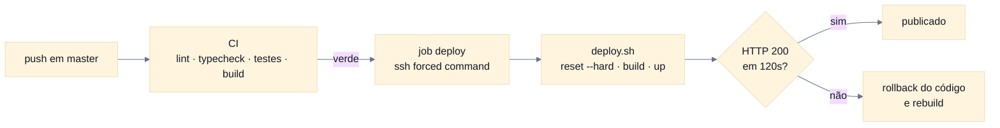

<div align="center">


**Mais perto do que você imagina. Mais interessante do que você esperava.**

<p>
  <a href="https://adonisjs.com/"></a>
  <a href="https://react.dev/"></a>
  <a href="https://www.postgresql.org/"></a>
  <a href="https://redis.io/"></a>
  <a href="https://tailwindcss.com/"></a>
  <a href="./docs/product/README.md"></a>
  <a href="./LICENSE"></a>
</p>

<p>
  <a href="README.md">Português</a>
  ·
  <a href="README.en.md">English</a>
</p>

---

_"Cidade e categoria são dimensões de descoberta. Tenant é uma operação isolada da plataforma."_

</div>

---

> [!IMPORTANT]
> **Descoberta primeiro, sem exigir cadastro.** O Experimente+ é um guia regional multicidade e
> multicategoria: encontra restaurantes, cafés, cultura, bem-estar e serviços locais com fichas
> revisadas antes da publicação. O catálogo público é resolvido por operação, não por membership —
> ninguém precisa de conta para explorar.

> [!NOTE]
> **Feito para uma região real.** O lançamento inicial é o norte do Paraná, na região de Cornélio
> Procópio, Londrina e municípios próximos. Restaurantes, bares e cafés são o núcleo, mas o produto
> permanece extensível a cinemas, estúdios de tatuagem, lazer, cultura e outros serviços locais.
> Tour Londrina é referência de experiência, não contrato funcional a ser copiado.

---

## Início rápido

```bash
# Dependências
mise use node@24
pnpm install --frozen-lockfile

# Ambiente local
cp .env.example .env
pnpm ace generate:key

# Infraestrutura
docker compose up -d postgres redis mailpit

# Banco e dados de desenvolvimento
pnpm ace migration:run
pnpm ace db:seed

# Servidor Adonis + Inertia com HMR
pnpm dev
```

A aplicação sobe em `http://localhost:3333`. Pré-requisitos: Node.js 24 (conforme `.nvmrc`),
pnpm 11 e Docker Compose.

---

## O que faz

| Camada           | Propósito                                                                    | Onde vive                                |
| :--------------- | :--------------------------------------------------------------------------- | :--------------------------------------- |
| **Geografia**    | Regiões, cidades e catálogo geográfico público.                              | `app/modules/geography/`                 |
| **Taxonomia**    | Categorias hierárquicas com atributos tipados e herança efetiva.             | `app/modules/taxonomy/`                  |
| **Organizações** | Memberships, convites e claims transacionais sobre estabelecimentos.         | `app/modules/organizations/`             |
| **Unidades**     | Identidade estável com conteúdo público revisionado e completude versionada. | `app/modules/establishments/`            |
| **Moderação**    | Submissão, gates de publicação e histórico de revisões.                      | `app/modules/establishments/` · `media/` |
| **Catálogo**     | Descoberta pública por cidade e categoria, servida de uma projeção.          | `app/modules/catalog/`                   |
| **Benefícios**   | Edições, ofertas, acessos e resgates da carteira do consumidor.              | `app/modules/benefits/`                  |
| **Analytics**    | Impressões, cliques de contato e buscas sem resultado, com retenção.         | `app/modules/analytics/`                 |

---

## Arquitetura



O catálogo público resolve a operação pelo hostname ou por `PUBLIC_TENANT_SLUG`, sem exigir
membership. As áreas autenticadas passam por RBAC, permissões contextuais e ownership.

---

## Estrutura

```text
app/modules/<domain>/   domínio completo no backend
app/shared/             infraestrutura transversal
database/               migrations, factories e seeders
inertia/                páginas, layouts, componentes e hooks
resources/              traduções, templates Edge e e-mails
tests/                  testes unitários, funcionais e browser
docs/product/           visão, MVP, roadmap e decisões de produto
docs/architecture/      ADRs e contratos técnicos aceitos
docs/                   OpenAPI, Redoc e requisições HTTP
```

Cada domínio mantém controllers, services, repositories, models, validators e rotas próximos. Os
generators do Adonis criam arquivos no layout padrão; mova o resultado para `app/modules/<domain>/`
e ajuste os aliases para `#modules/*` e `#shared/*`.

---

## Ambiente local

| Serviço      | Endereço                     |
| ------------ | ---------------------------- |
| Aplicação    | `http://localhost:3333`      |
| PostgreSQL   | `localhost:5435`             |
| Redis        | `localhost:6381`             |
| Mailpit SMTP | `localhost:1026`             |
| Mailpit UI   | `http://localhost:8026`      |
| Redoc        | `http://localhost:3333/docs` |

As portas podem ser alteradas no `.env`.

### Contas de desenvolvimento

O seeder cria três contas determinísticas para percorrer o piloto completo:

```text
Admin:    admin@experimente.local
Parceiro: partner@experimente.local
Cliente:  cliente@experimente.local
Senha:    experimente123
```

> [!WARNING]
> Essas credenciais existem apenas para o ambiente local e nunca devem alcançar um host acessível
> pela internet. Elas são configuráveis por `DEV_ADMIN_*`, `DEV_PARTNER_*` e `DEV_CUSTOMER_*`.
> Os dados regionais, estabelecimentos, ofertas e acessos criados pelo seeder são fictícios.

O seeder é `static environment = ['development']`: com `NODE_ENV=production` ele é ignorado.

---

## Comandos

```bash
pnpm dev                 # servidor e Vite com HMR
pnpm build               # build client, SSR e backend
pnpm lint                # ESLint
pnpm typecheck           # TypeScript backend + frontend
pnpm test:e2e            # Japa: unit, functional e browser
pnpm test:ui             # Vitest
pnpm ace migration:run   # aplica migrations
pnpm ace migration:fresh # recria o schema
pnpm ace db:seed         # dados determinísticos de desenvolvimento
```

> [!NOTE]
> Este projeto roda AdonisJS 7 com TypeScript direto via `@poppinss/ts-exec`. Não existe mais
> `node ace`: use `pnpm ace <comando>`.

---

## Configuração

| Variável                                             | Finalidade                                        |
| ---------------------------------------------------- | ------------------------------------------------- |
| `APP_NAME`, `VITE_APP_NAME`, `APP_URL`               | identidade e URLs da aplicação                    |
| `APP_LOCALE`                                         | locale padrão (`pt` ou `en`)                      |
| `PUBLIC_TENANT_SLUG`                                 | operação pública quando o host não a resolve      |
| `BENEFIT_PRESENTATION_BASE_URL`                      | origem HTTP(S) canônica dos links de validação QR |
| `ACCESS_TOKEN_SECRET`, `REFRESH_TOKEN_SECRET`        | segredos independentes da API                     |
| `EMAIL_VERIFICATION_SECRET`, `PASSWORD_RESET_SECRET` | HMAC de links de uso único                        |
| `JWT_ISSUER`, `JWT_AUDIENCE`, `JWT_COOKIE_NAME`      | identidade dos tokens e cookie web                |
| `REGISTRATION_WORKSPACE_MODE`                        | onboarding `none`, `personal` ou `operation`      |
| `DEMO_PAGES_ENABLED`                                 | páginas internas de referência visual             |
| `DRIVE_DISK`                                         | `fs`, `s3`, `spaces`, `r2` ou `gcs`               |

Os segredos opcionais usam `APP_KEY` como fallback apenas durante o desenvolvimento. Produção deve
utilizar valores longos, independentes e armazenados fora do repositório.

A origem incorporada ao QR segue uma precedência fechada: `BENEFIT_PRESENTATION_BASE_URL`; depois,
somente em produção, `APP_URL`; e protocolo/host confiáveis da requisição apenas em desenvolvimento
ou teste. As duas variáveis aceitas em produção devem conter somente uma origem absoluta `http://`
ou `https://`, sem credenciais, caminho, query ou fragmento. O bootstrap de produção falha quando
nenhuma origem canônica válida está disponível, evitando que `Host` ou `X-Forwarded-Host` controle
o link de validação.

> [!IMPORTANT]
> O resolver público lê o **primeiro rótulo do hostname**. Em `experimente-plus.exemplo.com` ele
> procura uma operação de slug `experimente-plus` e ignora `PUBLIC_TENANT_SLUG`. O slug do tenant
> precisa acompanhar o subdomínio em que a operação é servida.

---

## Deploy

A pipeline em [`.github/workflows/ci-cd.yml`](.github/workflows/ci-cd.yml) roda em todo push:
instalação frozen, lint, typecheck, suítes Japa, Vitest e build de produção. Em `master`, um job
`deploy` conecta por SSH e dispara [`deploy.sh`](deploy.sh) no host.



`deploy.sh` sincroniza com `origin/master`, reconstrói a imagem, sobe o container — que aplica as
migrations pendentes antes de servir — e espera a aplicação responder. Se ela não responder, o
código volta ao commit anterior.

> [!WARNING]
> O rollback é **apenas de código**. Migrations já aplicadas não são revertidas.

[`docker-compose.vps.yml`](docker-compose.vps.yml) descreve o host: apenas o serviço da aplicação,
publicando somente no loopback, atrás de um nginx que termina TLS. PostgreSQL e Redis são
containers compartilhados alcançados por rede Docker externa.

A chave usada pela CI carrega um _forced command_ no `authorized_keys` do host, então ela executa
`deploy.sh` e nada mais.

---

## Migrations antes da versão 1.0

Enquanto o produto não possui uma versão estável publicada, o schema deve representar uma
instalação nova e canônica. Mudanças em tabelas ainda não lançadas entram na migration `create_*`
original; bancos descartáveis de desenvolvimento e teste devem ser recriados.

Depois da primeira versão estável, o histórico passa a ser append-only.

---

## Planejamento de produto

O plano canônico está em [`docs/product/`](docs/product/README.md) e os contratos técnicos aceitos
em [`docs/architecture/decisions/`](docs/architecture/decisions/README.md): visão e modelo de
negócio, atores e jornadas, MVP, métricas e roadmap, modelo de cidades, organizações e unidades,
mapa de domínios, decisões aceitas, questões abertas e referências de mercado.

Nenhuma migration de negócio deve ser criada antes de a decisão correspondente estar registrada no
planejamento e, quando estrutural, em um ADR aceito.

---

## Licença

MIT. Consulte [LICENSE](LICENSE).
