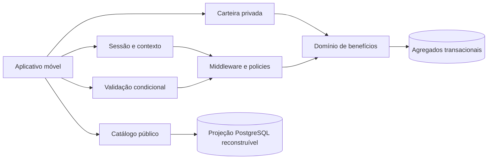

# ADR 0022 — Contrato de API móvel consumer-first

**Status:** aceito  
**Data:** 4 de setembro de 2026  
**Marco:** EP-12 — Mobile API Readiness  
**Relacionados:** ADR-0001, ADR-0003, ADR-0007, ADR-0016, ADR-0020 e ADR-0021

## Contexto

O catálogo, a carteira e o resgate já fecham o ciclo operacional no navegador. Um aplicativo móvel
precisa consumir o mesmo domínio sem duplicar autorização, recalcular disponibilidade ou transformar
decisões de apresentação em estado local. Também precisa descobrir de forma estável quando deve
mostrar o modo parceiro, pois Partner é uma membership da organização e não um papel global.

O primeiro cliente será consumer-first: **Explorar**, **Carteira** e **Conta** formam a experiência
principal. **Validar benefício** aparece somente quando as capacidades projetadas pelo servidor
permitirem. O contrato deve continuar útil para um cliente nativo ou PWA sem antecipar checkout,
favoritos, push ou operação offline.

## Decisão

### 1. Cliente fino sobre uma API canônica

O aplicativo não possui backend paralelo. Ele consome as rotas JSON canônicas de sessão, catálogo,
perfil, carteira e resgate. Toda decisão de visibilidade, disponibilidade, horário, ownership, limite
e autorização permanece no servidor.



`GET /api/v1/me/context` é o bootstrap autenticado. Sua resposta é uma allowlist de usuário,
operação ativa, operações acessíveis e capacidades. O cliente pode usar a projeção para compor a
interface, mas ela nunca autoriza uma requisição subsequente.

### 2. Operação e cidade continuam conceitos distintos

Tenant representa uma operação isolada da plataforma. Cidade é uma dimensão pública de descoberta.
O catálogo resolve a operação pelo hostname confiável e não aceita `tenant_id` do usuário. Rotas
privadas usam o tenant assinado no access token ou `x-tenant-id`; qualquer override é revalidado
contra um vínculo ou acesso ativo do ator à operação selecionada.

O aplicativo pode trocar de cidade sem trocar de operação. Trocar a operação autenticada usa o
contrato de tenant e recebe um novo par de tokens.

### 3. Capabilities controlam composição, policies controlam acesso

A projeção móvel diferencia:

- `partner.enabled`: existe alguma membership ativa de organização na operação;
- `partner.redemptions.read`: o ator pode abrir histórico e comprovantes;
- `partner.redemptions.validate`: o ator pode visualizar e confirmar uma apresentação;
- `platform_access`: acesso operacional global projetado como `platform_admin`,
  `platform_moderator` ou `null`.

A interface usa as capacidades específicas de `redemptions` para mostrar ações. Não pode usar apenas
`partner.enabled`: Root e Administrador podem receber `partner.redemptions.read` e
`partner.redemptions.validate` sem membership de organização, mas somente no tenant ativo e
acessível. Moderador sem membership de organização não recebe essas capabilities nem o modo
parceiro. Em todos os casos o endpoint repete a autorização de domínio.

### 4. Sessões são curtas e renováveis

Todo par retorna:

```text
token_type = Bearer
expires_in = 900
refresh_expires_in = 259200
```

O access token é um JWT de quinze minutos. O refresh token é opaco, de uso único, armazenado no
servidor apenas como HMAC e rotacionado atomicamente. No cliente nativo, credenciais persistentes
ficam somente no Keychain/Keystore da plataforma; o cliente substitui o refresh token após cada
rotação e encerra a sessão quando a renovação retornar `401`. Essa estratégia nativa segue a
proteção indicada para clientes públicos na [RFC 9700](https://datatracker.ietf.org/doc/html/rfc9700)
e os controles de autenticação e armazenamento do
[OWASP MASVS](https://mas.owasp.org/MASVS/).

Uma PWA exige estratégia de sessão própria, adequada ao modelo de ameaças da web. Em particular, o
refresh token não pode ser persistido em `localStorage`, `sessionStorage`, IndexedDB ou qualquer
outro armazenamento acessível a JavaScript. O mecanismo web deve ser definido e revisado antes de
liberar esse cliente.

### 5. Apresentação temporária não vira autorização local

O consumidor cria uma apresentação de cinco minutos a partir de um benefício que o servidor ainda
considera utilizável. O QR contém a URL de validação e um token assinado. Preview e confirmação
reavaliam tenant, ownership, estado, horário, limite e capacidade da organização.

O link usa a origem escolhida nesta ordem:

1. `BENEFIT_PRESENTATION_BASE_URL`;
2. `APP_URL`, somente em produção;
3. origem confiável da requisição, somente em desenvolvimento e teste.

O cliente não envia a origem. Repetir a confirmação do mesmo token retorna o comprovante original,
o que permite retry seguro após uma resposta de rede ambígua sem criar outro resgate.

O token aparece na query string da URL aberta pela câmera. Por isso:

- aplicativo, analytics e comprovantes não registram o token;
- respostas privadas usam `Referrer-Policy: no-referrer`;
- **o proxy/gateway deve redigir a query string completa nos access logs antes do piloto**;
- associação futura por Universal Links/App Links nunca poderá confirmar um resgate diretamente:
  abrirá apenas o preview autenticado.

### 6. Respostas privadas e contenção de abuso

Contexto, atualização de perfil, carteira, apresentação, preview, confirmação, históricos e
comprovantes retornam:

```text
Cache-Control: private, no-store
X-Robots-Tag: noindex, nofollow
Referrer-Policy: no-referrer
```

As mesmas rotas usam o throttle autenticado de 100 requisições por minuto por usuário. Uma resposta
`429` informa `Retry-After` e headers de limite. O cliente deve respeitar esse intervalo e não criar
loops automáticos.

Os envelopes existentes continuam explícitos no OpenAPI, mesmo não sendo globalmente uniformes:

- autenticação e credenciais: `{ errors: [{ message }] }`;
- VineJS `422`: `{ errors: [{ message, field, rule, ... }] }`;
- exceções de domínio: `{ status, message }`;
- limiter `429`: `{ errors: [{ code, message, status }] }`.

Uniformizar todos os erros é uma evolução separada; o EP-12 não altera contratos legados.

### 7. O OpenAPI é verificável contra o router

`docs/openapi.yaml` é OpenAPI 3.1 e registra os DTOs móveis como objetos fechados. Uma regressão
funcional parseia o YAML, exige `operationId` globalmente único e compara uma allowlist de métodos e
paths móveis com `router.toJSON()`. A comparação é deliberadamente seletiva para não confundir rotas
SSR, documentação e superfícies administrativas com o contrato do aplicativo.

## Consequências

### Positivas

- um único backend decide regras para web e aplicativo;
- navegação parceira deriva de capacidades estáveis sem confundir role global e membership;
- retries de confirmação são seguros e auditáveis;
- DTOs fechados reduzem acoplamento com models Lucid;
- OpenAPI e exemplos HTTP passam a cobrir a jornada completa.

### Custos

- o aplicativo precisa coordenar rotação de refresh token entre requisições concorrentes;
- históricos ainda são listas integrais e exigirão paginação antes de grande volume;
- o QR depende de conectividade para todas as revalidações;
- os formatos de erro legados exigem um adaptador simples no cliente.

## Fora de escopo

- checkout, assinatura, cobrança, reembolso e conciliação;
- favoritos, avaliações, push e sincronização offline;
- login social e biometria como mecanismo de autenticação do servidor;
- resgate offline, cancelamento ou edição de resgate;
- arquivos e certificados de Universal Links/App Links;
- geração de SDK antes de o contrato estabilizar no piloto;
- paginação de históricos sem evidência de volume.

## Cenários obrigatórios

- login, cadastro, refresh e troca de operação expõem os mesmos metadados de token;
- contexto não serializa campos internos de usuário ou organização;
- consumidor não recebe capacidades parceiras inventadas;
- owner/editor validam, analyst somente lê e Moderador sem membership de organização não recebe
  capabilities parceiras;
- Root/Administrador podem preservar acesso operacional sem membership de organização nem serem
  modelados como Partner, sempre no tenant ativo e acessível;
- cidade pode mudar na descoberta sem trocar o tenant autenticado;
- perfil ignora campos fora de `full_name` e `username`;
- carteira vazia é estado válido e não erro;
- apresentação inválida ou expirada orienta geração de novo código;
- retry da confirmação retorna o mesmo comprovante;
- recibos respeitam tenant, titular e organização, ocultando IDOR com `404` quando aplicável;
- todas as respostas privadas possuem os três headers;
- throttle retorna `429` recuperável;
- parser OpenAPI, unicidade de `operationId` e paridade seletiva com o router permanecem verdes;
- proxy de produção não persiste query strings de validação nos access logs.
