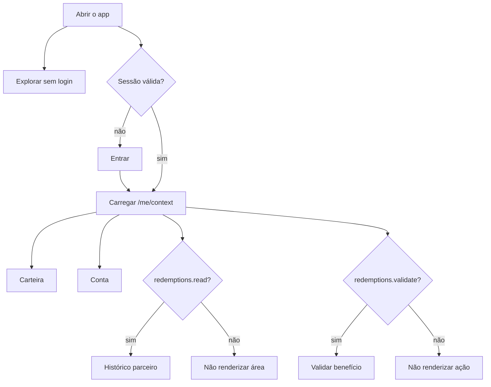
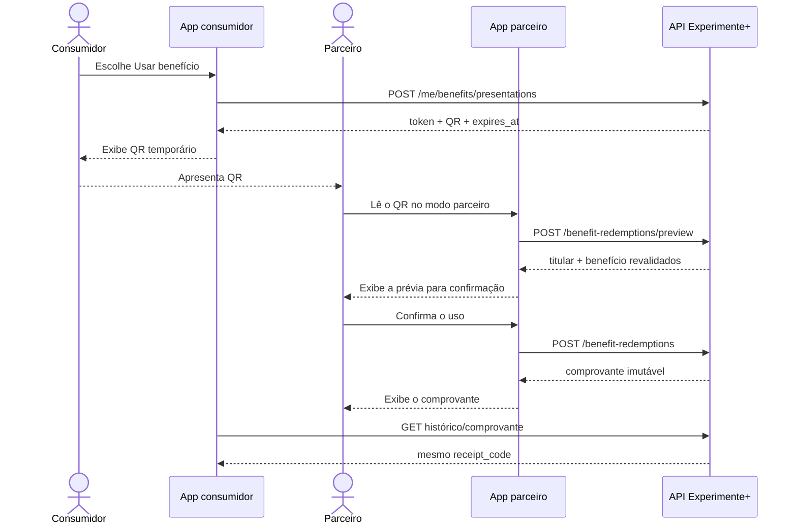

# 17 — Aplicativo móvel consumer-first

**Estado:** contrato aceito para o piloto em 4 de setembro de 2026.  
**Marco:** EP-12 — Mobile API Readiness.

## Objetivo

Levar a jornada validada do Experimente+ para um aplicativo simples, direto e coerente, sem criar um
segundo produto ou antecipar funcionalidades sem evidência. O app inicial ajuda a pessoa a descobrir
lugares, consultar seus benefícios e apresentar um benefício. Quando o servidor identificar uma
capacidade autorizada, o mesmo cliente também oferece validação ao parceiro.

O aplicativo continua um cliente fino: regras, availability, horário, operação, autorização e
resgate pertencem ao backend.

## Estrutura do produto

| Área      | Público                          | Regra de presença                                         |
| --------- | -------------------------------- | --------------------------------------------------------- |
| Explorar  | qualquer pessoa                  | sempre; catálogo público por hostname, cidade e categoria |
| Carteira  | consumidor autenticado           | sempre após login; pode estar vazia                       |
| Conta     | pessoa autenticada               | sempre após login                                         |
| Validar   | parceiro ou staff com capability | somente com `partner.redemptions.validate = true`         |
| Histórico | parceiro ou staff com capability | somente com `partner.redemptions.read = true`             |

`partner.enabled` significa que existe uma membership ativa de organização. Ele não substitui as
capabilities específicas: staff autorizado da plataforma pode operar resgates sem membership de
organização, mas sempre dentro de um tenant ativo e acessível; Moderador sem membership de
organização não se torna parceiro.

## Jornadas prioritárias

### UC-M01 — Explorar uma cidade

**Ator:** visitante ou pessoa autenticada.  
**Pré-condição:** hostname público reconhecido pela operação.

1. O app lista cidades publicadas.
2. A pessoa escolhe uma cidade e, opcionalmente, uma categoria.
3. O app consulta estabelecimentos com `category`, busca textual, abertura e paginação.
4. A pessoa abre a ficha publicada.

**Alternativas:** hostname, cidade ou ficha ausente resulta em tela neutra de indisponibilidade; uma
categoria bem formada mas inexistente produz a lista vazia canônica. O app nunca pede tenant para
exploração pública e nunca recalcula `open_now`.

### UC-M02 — Entrar e recuperar o contexto

**Ator:** pessoa cadastrada.

1. O app autentica por e-mail ou username.
2. No app instalado/nativo, guarda access e refresh token no Keychain/Keystore do sistema; uma PWA
   não persiste o refresh token em armazenamento acessível a JavaScript.
3. Carrega `/api/v1/me/context`.
4. Monta as áreas a partir da operação ativa e das capabilities.

**Alternativas:** `401` no refresh encerra a sessão local; `403` no override remove a seleção
inacessível e recarrega o contexto; ausência de operação ativa mostra orientação operacional, sem
chamar cidade de tenant.

### UC-M03 — Consultar e apresentar um benefício

**Ator:** consumidor autenticado com acesso ativo.

1. O app carrega a carteira derivada.
2. A pessoa lê estabelecimento, regras, disponibilidade e usos restantes.
3. O app solicita uma apresentação para `access_id` e `offer_id`.
4. Exibe o QR, o vencimento de cinco minutos e uma ação para gerar outro código.

**Alternativas:** carteira sem passes apresenta onboarding vazio; benefício fora de horário ou
esgotado mantém explicação sem ação; código expirado não é reaproveitado e a pessoa gera nova
apresentação.

`App consumidor` e `App parceiro` são duas instâncias do mesmo produto, compostas pelas
capabilities retornadas pelo servidor.

### UC-M04 — Validar como parceiro

**Ator:** owner, admin ou editor de organização; Root/Administrador de plataforma somente no tenant
ativo e acessível.

1. O app lê ou recebe o link apresentado.
2. Envia o token para preview autenticado.
3. Mostra titular, unidade, oferta, termos e usos restantes.
4. Exige confirmação humana explícita.
5. Envia o token para resgate e exibe o comprovante.

**Alternativas:** analyst pode consultar histórico, mas não valida; parceiro de outra organização não
vê titular ou benefício; token inválido/expirado pede novo QR; resposta de rede ambígua permite retry
da confirmação, que retorna o mesmo comprovante.

### UC-M05 — Consultar comprovantes

**Ator:** consumidor titular, parceiro ou staff autorizado.

- consumidor lista apenas os próprios usos da operação ativa;
- ator operacional lista somente organizações permitidas por policy;
- todos abrem o mesmo snapshot de edição, oferta, termos, unidade, titular e data;
- código inexistente ou inacessível é tratado como indisponível, sem revelar ownership.

### UC-M06 — Editar conta

**Ator:** pessoa autenticada.

1. O app altera parcialmente nome ou username.
2. O servidor devolve somente a projeção pública do próprio usuário.
3. E-mail, senha, verificação e campos administrativos não são editáveis nessa operação.

Exclusão permanece uma ação separada e destrutiva, protegida por senha atual e pelo literal
`EXCLUIR MINHA CONTA`.

## Estados de interface obrigatórios

| Situação                     | Resposta de produto                                                         |
| ---------------------------- | --------------------------------------------------------------------------- |
| carregamento inicial         | skeleton estável, sem piscar áreas de parceiro antes do contexto            |
| catálogo vazio               | mensagem ligada à cidade/filtro e ação para limpar filtro                   |
| carteira vazia               | explicação de como o acesso aparece; não sugerir checkout inexistente       |
| benefício indisponível       | motivo projetado pelo servidor e ação desabilitada                          |
| apresentação expirando       | contador por `expires_at`; ação de renovar, sem estender localmente         |
| token inválido ou expirado   | orientação para pedir/gerar uma nova apresentação                           |
| `401`                        | uma tentativa coordenada de refresh; depois, login                          |
| `403`                        | recarregar contexto e remover ação não autorizada                           |
| `404` privado                | indisponível genérico; não revelar outro titular, tenant ou organização     |
| `422`                        | mensagem junto ao campo ou ação correspondente                              |
| `429`                        | bloquear retry automático até `Retry-After`                                 |
| falha de rede em leitura     | retry manual preservando filtros                                            |
| falha ambígua na confirmação | retry permitido com o mesmo token; backend responde com o mesmo comprovante |

## Regras de sessão e segurança no dispositivo

- access token dura quinze minutos; refresh token dura três dias e gira a cada uso;
- refresh simultâneo é serializado pelo cliente para não reutilizar a credencial anterior;
- no app instalado/nativo, credenciais persistentes ficam somente no Keychain/Keystore;
- na PWA, o refresh token não é persistido em `localStorage`, `sessionStorage`, IndexedDB ou outro
  armazenamento acessível a JavaScript; a estratégia de sessão web própria permanece adiada;
- logs, crash reports, analytics, clipboard e notificações não recebem tokens;
- QR e `validation_url` são conteúdo privado e não entram em cache;
- o app não aceita base URL de apresentação vinda de payload ou configuração remota não confiável;
- preview nunca confirma automaticamente o uso;
- erro de rede não autoriza decisão offline.

O token do QR aparece na query string do link de validação. Além dos headers privados da API,
**o gateway de produção deve redigir a query string nos access logs antes do piloto em dispositivo**.

## Contrato de retry

- GETs podem ser repetidos com backoff e preservação de contexto;
- refresh usa o novo token devolvido e invalida imediatamente o anterior;
- apresentação expirada gera um novo token, nunca altera o vencimento localmente;
- preview pode ser repetido enquanto o token for válido;
- confirmação pode repetir o mesmo token depois de timeout, pois o resgate é idempotente por nonce;
- `422`, `403` e erros de regra não entram em retry automático;
- `429` respeita obrigatoriamente `Retry-After`.

## Critérios do piloto móvel

- Explorar funciona sem autenticação e sem tenant escolhido pelo usuário;
- login e refresh sobrevivem a reinício do app instalado sem expor credenciais;
- contexto não mostra navegação indevida durante carregamento ou troca de operação;
- carteira vazia e benefício indisponível são compreensíveis;
- QR é lido por câmera real em Android e iOS;
- parceiro conclui preview e confirmação sem intervenção técnica;
- consumidor e parceiro encontram o mesmo comprovante;
- retry após perda de resposta não duplica uso;
- logs de app, proxy e analytics não contêm token ou query de validação;
- contraste, toque, teclado, leitor de tela e tamanhos de texto são verificados nos dispositivos do
  piloto.

## Decisões adiadas

- stack nativa ou multiplataforma e arquitetura de navegação do cliente;
- estratégia de sessão persistente para PWA;
- bundle IDs, assinatura, distribuição e observabilidade móvel;
- domínio público e arquivos/certificados de Universal Links e App Links;
- favoritos, avaliações, compartilhamento social e push;
- GPS obrigatório, geofencing e antifraude genérico;
- checkout, assinatura, promo code e pagamento;
- paginação e filtros de histórico;
- funcionamento e resgate offline;
- login social e biometria local;
- editor completo de organização e estabelecimento no app.

Esses itens entram no backlog somente por evidência do piloto ou por dependência de distribuição. O
contrato atual não promete nenhum deles.
